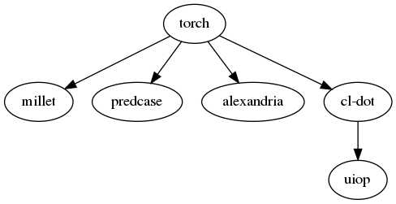
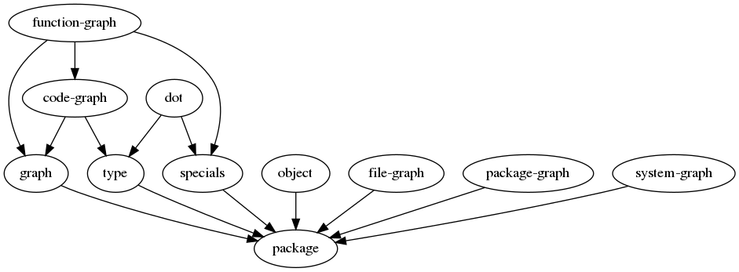
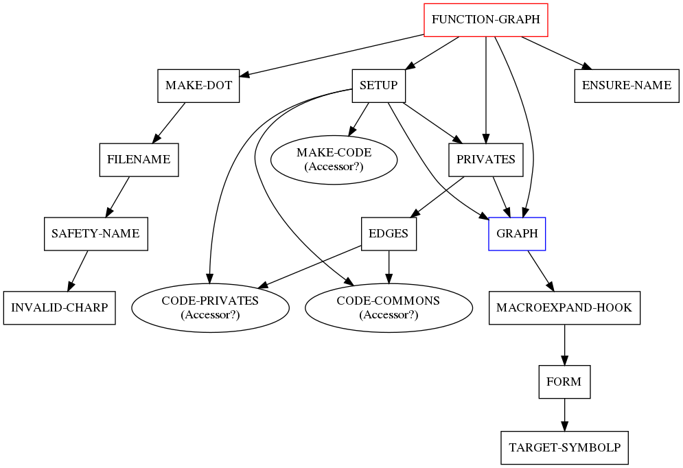
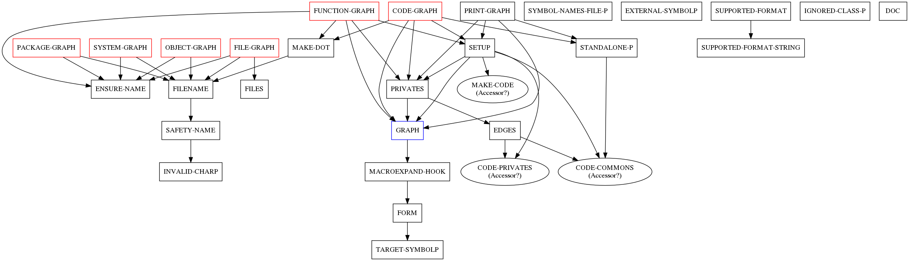

# TORCH - Making the graph for helping the maintainer to grasp the system.

TORCH makes the graph file which represents lisp system meta info.
It helps you to grasp the third parson's system strcuture.

TORCH uses GRAPHVIZ.
You need to install it.

## Usage
### System dependency graph.

```lisp
(torch:system-graph :torch)
```



### System component dependency graph.

```lisp
(torch:file-graph :torch)
```



### Function dependency graph.

```lisp
(torch:function-graph 'torch:function-graph)
```
Red box means it is external symbol.

Blue box means it name is used as component name too. (i.e. lisp file name.)

Circle means it is generated automatically by DEFCLASS, DEFSTRUCT or DEFINE-CONDITION.



### Code graph.

```lisp
(gorch:code-graph :torch)
```



## From developer

* Product's goal
mmmm...  already?

* License
* Supported implementation
CLISP CCL SBCL ECL.
But maybe works well any other lisps.

